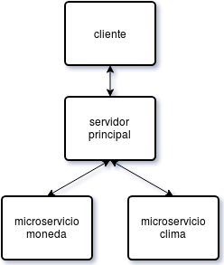
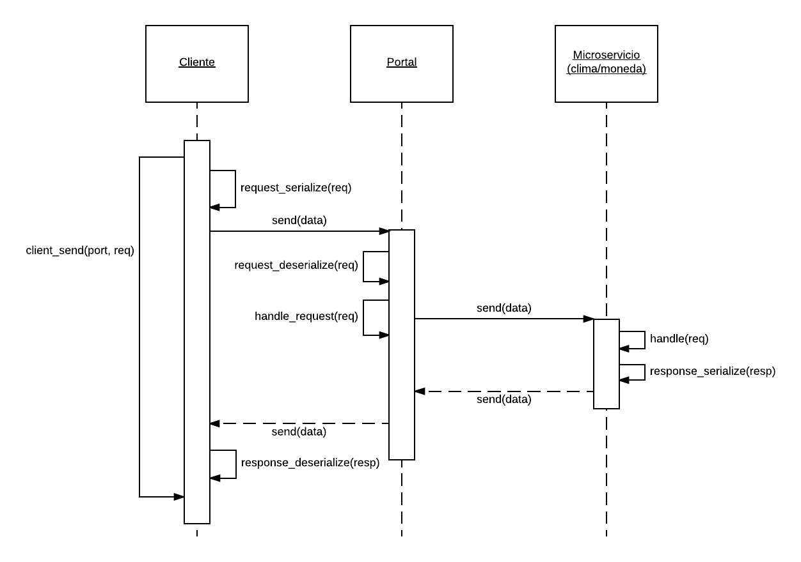

## 1. Introducción

En este proyecto, nos dispusimos a desarrollar una aplicación capaz de simular un portal de noticias,
basándonos en el modelo cliente-servidor, y una arquitectura orientada a microservicios. Así, el objetivo del
trabajo fue el de aplicar alguno de los mecanismos de comunicación de procesos vistos en la segunda parte de
la materia a esta situación, ante lo cual se optó por emplear sockets.

A continuación, se detallarán los pasos tomados durante el desarrollo del trabajo, haciendo hincapié en la
implementación de la concurrencia y la comunicación entre los procesos.

## 2. División en procesos
Como primer tarea en este proyecto, se procedió a identificar los distintos procesos concurrentes que luego
conformarían la estructura de la aplicación. La idea en este primer paso fue así la de poder reconocer agentes
o entidades que pudieran actuar de forma concurrente, para poder encaminar el diseño en base a este análisis.

Examinando el enunciado, pudimos identificar rápidamente como entidades concurrentes a los *microservicios*,
habiendo puntualmente dos en este caso: el microservicio informador del valor de las monedas de otros países,
y el del estado del tiempo en las ciudades del país. La justificación para pensar en ambos como procesos se
basa en la misma estructura de microservicios: tanto el informador del tiempo como el de las monedas
representan estructuras aisladas e independientes, con funcionalidades específicas distintas, que además deben
estar preparadas para trabajar por separado sin necesidad del otro. Además, pensándolo como un sistema a mayor
escala, si hubieran de agregarse más microservicios a la aplicación, hacer que cada uno de ellos fuese un
proceso único y distinto facilitaría la integración del sistema resultante. Luego, con todo esto dicho,
consideramos que los dos microservicios debían representar cada uno un proceso propio.

Habiendo reconocido a los microservicios como procesos, y recordando la implementación de modelo
cliente-servidor, se vio que cada *cliente* también debía representar un proceso en nuestro sistema. Esto es
así, ya que cada cliente debería poder correr independientemente de los servicios ofrecidos a ellos,
permitiendo además que varios de ellos lo hicieran a la vez, enviando diversos requests a los microservicios
ya mencionados. Junto con estos clientes surge también la figura del *administrador*, capaz de modificar los
datos de los microservicios al conectarse contra ellos. Desde una perspectiva similar al protocolo HTTP,
mientras que los clientes efectúan requests a los microservicios de tipo "GET" para obtener información de los
mismos, el administrador sería el que realizaría requests de tipo "PUT" para actualizar estos datos. Luego,
siendo el comportamiento de un administrador similar al de un cliente, también se optó por considerarlo como
un proceso aparte.

Finalmente, el *portal de noticias* fue el último proceso que identificamos en esta etapa. La razón de ser de
este proceso es algo diferente a la de los otros, debido a que su principal funcionalidad es la de proveer una
"fachada" para los distintos clientes (y el administrador), abstrayéndolos de los distintos microservicios
corriendo por separado. El portal entonces surge como un proceso necesario para lograr hacer converger todos
los posibles requests de los clientes en un único punto.

De esta manera, pudimos diseñar cómo debería ser el flujo de la comunicación entre los distintos procesos
vistos. En primer lugar, los distintos procesos clientes (o el administrador) intentan conectarse con el
portal de noticias, el cual actúa como un gran servidor de todos ellos. Una vez establecida la conexión, los
clientes efectúan los requests deseados, los cuales llegan al portal a través de la comunicación por sockets.
Con los datos del request en el portal, éste tiene la información suficiente para saber a cuál de los
microservicios despacharle el pedido, debiendo actuar en ese momento como un "cliente" de los microservicios.
Establecida la conexión entre portal y microservicio, éste último puede recibir el request original del
cliente, y la respuesta puede circular en el sentido inverso hasta llegar al proceso original. Naturalmente,
en caso de que el request fuera una modificación de datos por parte del administrador, el microservicio
correspondiente deberá además modificar su información local, de manera de satisfacer el pedido.

  

Como acercamiento inicial desarrollamos un servidor concurrente. Esto es, con cada petición se lanza un 
nuevo proceso que se encarga de satisfacerla. Sin embargo, al no poder utilizar los mecanismos de memoria
compartida u otro tipo de comunicación entre procesos, la actualización de la información por medio de un
pedido del administrador se dificultaba. Por esto, optamos por un servidor que atiende a los requests
de manera iterativa.

## 3. Protocolo de comunicación

La comunicación se realiza enteramente mediante sockets. Los pedidos y respuestas se serializan en formato JSON
para no depender de una arquitectura en particular.
En el alto nivel, los datos se guardan en estructuras (*mensajes*) los cuales soportan 3 tipos de datos:
 * float
 * integer
 * string

En el alto nivel, estos mensajes se cargan con los valores deseados y luego se envían, obteniendo una respuesta
que también es un mensaje.

Los servidores se implementaron sobre un mismo TDA (*server_t*). Este se encarga de manipular el socket y, al
recibir una conexión (mediante *accept*) ejecuta un callback definido al instanciar el servidor en el cual se envía
además el request serializado. El request realiza su tarea y completa el mensaje de respuesta, el cual luego se
serializa por el servidor hacia el cliente.

  

## 4. Conclusiones

En síntesis, pudimos confeccionar la aplicación del proyecto de forma exitosa, pudiendo separarla en procesos
concurrentes e implementando la comunicación entre los mismos a través de sockets. Comprobamos que los sockets
ofrecen gran flexibilidad para la comunicación entre procesos, incluso cuando estos se encuentran en computadoras
distintas.
